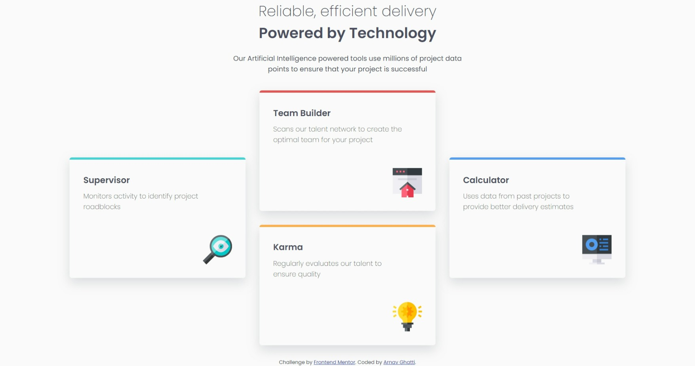
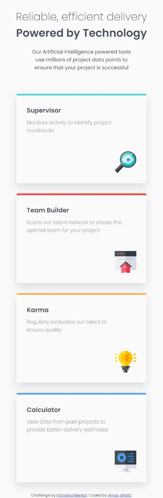

# Frontend Mentor - Four card feature section solution

This is a solution to the [Four card feature section challenge on Frontend Mentor](https://www.frontendmentor.io/challenges/four-card-feature-section-weK1eFYK). Frontend Mentor challenges help you improve your coding skills by building realistic projects. 

## Table of contents

- [Overview](#overview)
  - [The challenge](#the-challenge)
  - [Screenshot](#screenshot)
  - [Links](#links)
- [My process](#my-process)
  - [Built with](#built-with)
  - [Useful resources](#useful-resources)
- [Author](#author)

**Note: Delete this note and update the table of contents based on what sections you keep.**

## Overview

### The challenge

Users should be able to:

- View the optimal layout for the site depending on their device's screen size

### Screenshot




### Links

- Solution URL: [https://github.com/Arnav-Ghatti/4-Cards-Feature-Section](https://github.com/Arnav-Ghatti/4-Cards-Feature-Section)
- Live Site URL: [https://arnav-ghatti.github.io/4-Cards-Feature-Section/](https://arnav-ghatti.github.io/4-Cards-Feature-Section/)

## My process

### Built with

- CSS custom properties
- Flexbox

```css
.color {
    position: relative;
    top: -30px;
    left: -30px;
    height: 5px;
    width: 385px;
    border-top-left-radius: 5px;
    border-top-right-radius: 5px;
}
```

## Author

- Frontend Mentor - [@Arnav-Ghatti](https://www.frontendmentor.io/profile/Arnav-Ghatti)
